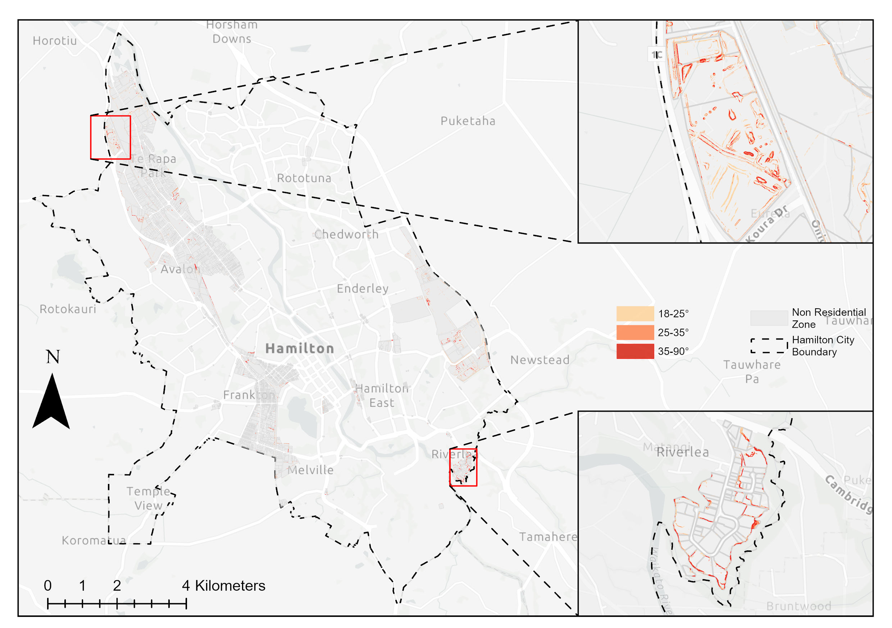

# Parcel-Level Slope Analysis (Hamilton City)

**Gongfan Zhang**
Technical Report Summary 

---

# 🚀 Run the Automated Pipeline

The full automated workflow is implemented in:

👉 **[`slope_analysis_pipeline.ipynb`](./slope_analysis_pipeline.ipynb)** 

***Note: Input datasets and regenerated outputs are not included in this GitHub repo.*** 

Detailed automation instruction please see: 👉 **[`automation_scripts_instruction.pdf`](./automation_scripts_instruction.pdf)**

Detailed technical report please: 👉 **[`Slope_Analysis_Technical_Report_Gongfan_Zhang.pdf`](./Slope_Analysis_Technical_Report_Gongfan_Zhang.pdf)**

---

## Software Requirements

* ArcGIS Pro (Spatial Analyst license required) 
* ArcGIS Pro Python environment (ArcPy-enabled) 

---

## Expected Local Folder Structure

Before running the notebook, prepare this structure locally: 

```
slope_analysis_delivery/
├── data/
│   ├── input/        # required input datasets (read-only)
│   ├── workspace/    # intermediate outputs (regenerable)
│   └── output/       # final outputs (regenerable)
└── slope_analysis_pipeline.ipynb
```

---

## Steps to Run

1. Open **`slope_analysis_pipeline.ipynb`** in **ArcGIS Pro** 
2. In the first cell, set `PROJECT_ROOT` to your local absolute path: 

```python
PROJECT_ROOT = r"C:\path\to\slope_analysis_delivery"
```

3. Run all cells **from top to bottom**. 

---

## Notes

* Do **not** delete `data/input/` (required inputs). 
* `data/workspace/` and `data/output/` are fully regenerable. 
* Re-running the notebook will regenerate intermediate and final outputs (as long as inputs remain unchanged). 

---

# Part 1 — Problem and Goals

## Problem

Development capacity assessments are typically based on planning rules and zoning controls. They do not explicitly account for physical site constraints such as terrain slope.

Slope influences:

* Earthworks requirements
* Site access
* Drainage behaviour
* Geotechnical stability
* Construction complexity and cost

As a result, there may be a gap between plan-enabled capacity and land that is practically developable at the parcel level.

---

## Goals

This project evaluates parcel-level slope conditions across Hamilton City to:

* Identify where slope may constrain residential and non-residential development
* Quantify steep slope exposure at multiple spatial scales
* Provide a reproducible workflow that can be re-run when inputs or assumptions change

---

# Part 2 — Methodology

## Data

* 1 m LiDAR-derived DEM
* NZ Primary Land Parcels
* Hamilton City boundary
* Residential / Non-Residential zoning
* Planning constraint layers
  (Facilities Zone, Knowledge Zone, Open Space Zone, Significant Natural Area)

All datasets were clipped to the Hamilton City boundary.
Constraint areas were removed from parcels before slope metrics were calculated.

---

## Workflow (High-Level)

* Derive slope (degrees) from the DEM
* Reclassify slope into defined bins
* Use **Tabulate Area** to calculate slope-class area within each parcel
* Define steep slope as **≥ 18°**
* Compute steep-slope area and proportion per parcel
* Classify steep-slope proportion into fixed **5% intervals**
* Post-process results using Python (ArcPy + pandas + matplotlib)
* Generate maps for spatial interpretation

---

## Automation

The full workflow is implemented as a modular Python/ArcPy pipeline within ArcGIS Pro.

When the required input datasets are supplied in the predefined folder structure, the pipeline automatically executes the complete analysis sequence — from slope derivation to parcel-level statistics and figure generation.

Execution typically takes several minutes, significantly reducing processing time compared to manual GIS workflows, which may require several hours of step-by-step operations.

### Key Advantages

* End-to-end automation of raster and vector processing
* Fully reproducible and regenerable outputs
* Modular design allowing parameter modification (e.g., slope thresholds)
* Suitable for re-running when new datasets or policy assumptions are introduced

Outputs were validated through:

* Manual processing comparison
* Visual inspection of spatial consistency

---

# Part 3 — Results

## 3.1 Literature-Derived Slope Classification

Slope was classified into six ranges linked to development suitability:

| Suitability | Slope (°) | Interpretation           |
| ----------- | --------: | ------------------------ |
| S1          |       0–6 | Highly suitable          |
| S2          |     >6–12 | Suitable                 |
| S3          |    >12–18 | Moderately suitable      |
| S4          |    >18–25 | Low suitability          |
| N1          |    >25–35 | Generally unsuitable     |
| N2          |       >35 | Unsuitable / high-hazard |

Steep slope threshold for parcel screening: **≥ 18°**

---

## 3.2 City-Level Results

Hamilton City is dominated by low to moderate slopes:

* 0–6°: **80.0%**
* <18° total: **95.9%**
* ≥35°: **0.5%**

Slope is not a dominant constraint at the city scale.

### City-Level Slope Map

<p align="center">
  
</p>

Gentle slopes dominate the city.
Steep slopes are limited, fragmented, and mainly associated with river corridors and local terrain features.

---

## 3.3 Zone-Level Results

Residential land shows higher **steep-slope exposure** than non-residential land:

* Residential zone (≥18°): **~4.6%**
* Non-residential zone (≥18°): **~2.2%**

Slope constraints are more relevant within residential areas.

---

### 3.3.1 Residential Steep Slope Distribution

<p align="center">
  
</p>

Steep slopes within residential land are spatially localised and aligned with terrain structure.

---

### 3.3.2 Non-Residential Steep Slope Distribution

<p align="center">
  
</p>

The spatial pattern is similar to the residential zone but less extensive in area.

---

## 3.4 Parcel-Level Results (Core Output)

Parcel-level analysis provides the most meaningful insight.

Across all parcels:

* 77.7% contain < 5% steep slope
* ~86% contain < 10% steep slope
* Parcels with > 25% steep slope are rare

Parcels with ≥10% steep slope coverage form clear spatial clusters.

<p align="center">
  
</p>

These parcels are:

* Spatially clustered
* Associated with river margins
* Terrain-dependent rather than evenly distributed

Slope constraints are therefore site-specific and parcel-dependent.

---

# Part 4 — Limitations & Future Work

## 4.1 Limitations

**Scope**
The analysis considers slope only. Other constraints (soil, flood risk, infrastructure, access) are not included.

**DEM Resolution**
The 1 m LiDAR DEM captures fine terrain variation but may introduce local noise. No smoothing was applied.

**Classification Assumptions**
Steep slope is defined as ≥18°. Parcel exposure is grouped into fixed 5% intervals. These thresholds are analytical choices and do not represent engineering cost breakpoints.

---

## 4.2 Future Work

**Multi-Constraint Analysis**
Integrate soil, flood, and infrastructure layers for a broader feasibility assessment.

**Cost Linkage**
Relate slope exposure to earthworks intensity and construction implications.

**Capacity Modelling**
Incorporate parcel-level slope metrics into development capacity or yield models.

**Sensitivity Testing**
Evaluate alternative slope thresholds, interval schemes, and DEM resolutions.

---


